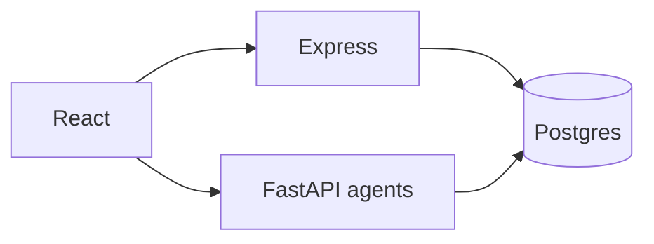

# Architecture

## Runtime

| Layer | Port | Notes |
|-------|------|--------|
| `frontend/` | Vite | Calls backend `/api` and agents `/api` on 8090 |
| `backend/` | 8081 | JWT, step-queue jobs, channels, observability |
| `agents/` | 8090 | LangChain DeepAgents bootstrap/analysis; LangChain agent chat |

Contracts: Zod (backend), Pydantic (`agents/app/schemas.py`), TS types in `frontend/src/types/api.ts`.

## Flow



Telegram/WhatsApp chat uses **backend** `agentChat` + Postgres `conversations`, not the agents service.

## Postgres ownership

| Domain | Tables / stores |
|--------|-----------------|
| Users, auth, lifecycle, schedule, persona | `users`, `userStore`, `personaStore` |
| Portfolio | `user_portfolios`, `portfolioStore` |
| Strategies | `strategies`, `strategyStore` |
| Jobs / steps | `jobs`, `step_work_items`, `jobStore` |
| Report JSON bodies | `report_artifacts`, `reportArtifactStore` |
| Job UI state | `orchestration_state`, `orchestrationStateStore` |
| Feed index | `report_batches`, `report_index`, `reportIndexStore` |
| Notifications, escalation, control, support | respective `*Store.ts` |
| Dashboard chat | `conversations`, `conversationStore` |
| LLM spend | `llm_requests` |

Schema source: `db/application_postgres.sql`.

## How DDL is applied (no migration runner)

There is **no** separate migration tool or version table. Schema changes work like this:

1. You edit `db/application_postgres.sql` and add **idempotent** SQL at the bottom (or anywhere in the file), for example:
   - `CREATE TABLE IF NOT EXISTS ...`
   - `ALTER TABLE ... ADD COLUMN IF NOT EXISTS ...`
   - `CREATE INDEX IF NOT EXISTS ...`
2. On **first** Postgres use in a backend process, `getApplicationDataSource()` in `backend/src/db/applicationDataSource.ts` reads the file (`APP_DATABASE_DDL_PATH`, default `../db/application_postgres.sql`) and runs the **entire file** in one `query()` call.
3. That runs **once per process** (`ddlApplied` flag). Restart the backend after deploy so new statements execute.
4. Statements that already ran are safe no-ops; **only new or changed idempotent statements have an effect**.

You can also apply the file yourself with `psql -f db/application_postgres.sql` before starting the backend; the backend will no-op on existing objects.

**Important:** Do not add destructive or non-idempotent SQL (bare `CREATE TABLE` without `IF NOT EXISTS`, `DROP`, data backfills) unless you run it manually once. The backend does not track which “migration version” you are on.

## Agents layout

```
agents/
  main.py                 # FastAPI
  bootstrap_agent/        # create_deep_agent + subagents
  analysis_agent/         # deep dive multi-agent
  chat_agent/             # create_agent + tools
  app/                    # services, schemas, Postgres store
```

Multi-agent pattern: **coordinator deep agent** delegates to named subagents; structured outputs at boundaries.

## Directories

- `data/` — system config (not per-user)
- `shared/user-workspace/` — `USER.md.template` only (seed for `users.persona_md`)
- `users/` — not used for product state
